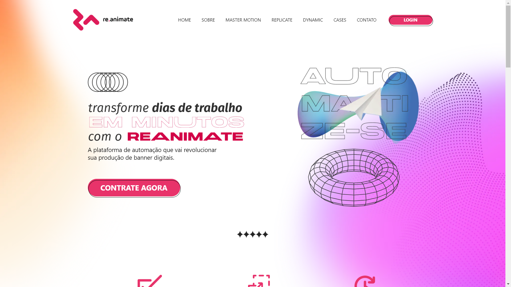
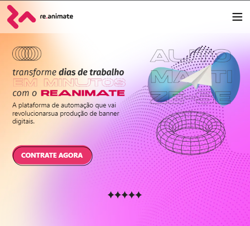
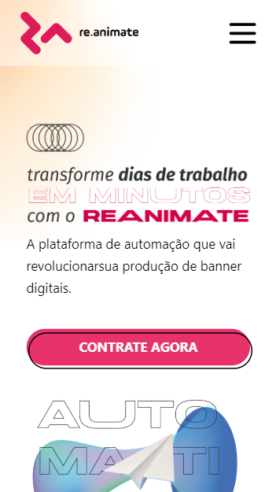

<h1 align="center" style="font-weight: bold;">Re.Animate 💻</h1>

 <a href="#tech">Tecnologias</a> • 
 <a href="#started">Instalação</a> 

  <b>
    Conheça o nosso novo site Re.animate! Com uma interface intuitiva e acessível, você pode explorar todas as funcionalidades do Re.animate de forma rápida e fácil. Personalize suas configurações, encontre soluções para suas necessidades digitais e descubra uma experiência única, tudo em um só lugar. Visite-nos agora mesmo e experimente!
  </b>

  <a href="https://re-animate.vercel.app/">📱 Veja o projeto</a>

<h2 id="layout">🎨 Layout</h2>

  <table border="0" cellpadding="0" cellspacing="0" align="center" width="90%" style="width: 90%; flex-wrap: wrap; flex-direction: row; display: flex;">
    <tr>
     <td style="display: flex;">
      <table border="0" cellpadding="0" cellspacing="0" align="center">
        <tr>
          <td align="center">
            
          </td>
        </tr>
        <tr>
          <td align="center">
            

              <b>Desktop</b>
            

          </td>
        </tr>
      </table>
     </td>
     <td style="display: flex;">
      <table border="0" cellpadding="0" cellspacing="0" align="center">
        <tr>
          <td align="center">
            
          </td>
        </tr>
        <tr>
          <td align="center">
            

              <b>Tablet</b>
            

          </td>
        </tr>
      </table>
     </td>
     <td style="display: flex;">
      <table border="0" cellpadding="0" cellspacing="0" align="center">
        <tr>
          <td align="center">
            
          </td>
        </tr>
        <tr>
          <td align="center">
            

              <b>Mobile</b>
            

          </td>
        </tr>
      </table>
     </td>
    </tr>
  </table>
 

<h2 id="tech">💻 Tecnologias</h2>

- Next JS (v14.1.4)
- Typescript (v5.0.0)
- Tailwind CSS (v3.3.0)
- Framer Motion (v11.0.25)
- Swiper (v11.1.1)
- React-icons (v5.0.1)

<h2 id="started">🚀 Instruções de Instalação</h2>

Para configurar e executar este projeto localmente, siga as etapas abaixo:

1. Clone o repositório: `git clone https://github.com/PedroLucas-Developer/Re.animate`
2. Navegue até o diretório do projeto: `cd Re.animate`
3. Instale as dependências: `npm install`
4. Inicie o servidor local: `npm run dev`
