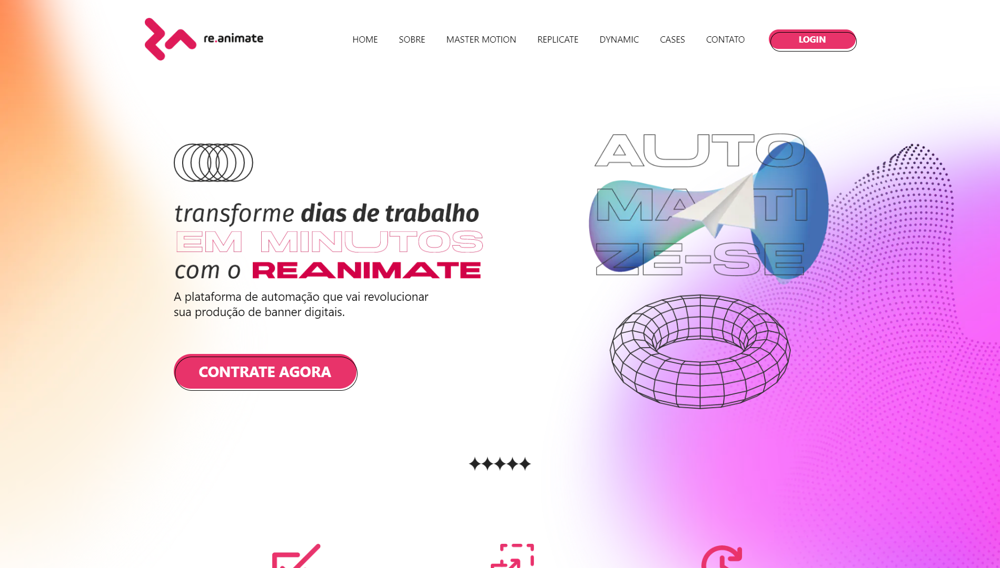

<h1 align="center" style="font-weight: bold;">Re.Animate 💻</h1>

 <a href="#tech">Tecnologias</a> • 
 <a href="#started">instalação</a> 

    <b>Conheça o nosso novo site Re.animate! Com uma interface intuitiva e acessível, você pode explorar todas as funcionalidades do Re.animate de forma rápida e fácil. Personalize suas configurações, encontre soluções para suas necessidades digitais e descubra uma experiência única, tudo em um só lugar. Visite-nos agora mesmo e experimente!</b>

     <a href="https://re-animate.vercel.app/">📱 Veja o projeto</a>

<h2 id="layout">🎨 Layout</h2>

    
    
    

<h2 id="technologies">💻 Tecnologias</h2>

- Next Js
- Typescript
- Tailwind Css
- Framer Motion
- Swiper
- React-icons

<h2 id="started">🚀 Instruções de Instalação</h2>

Para configurar e executar este projeto localmente, siga as etapas abaixo:

1. Clone o repositório: `git clone https://github.com/PedroLucas-Developer/Re.animate`
2. Navegue até o diretório do projeto: `cd Re.animate`
3. Instale as dependências: `npm install`
4. Inicie o servidor local: `npm run dev`